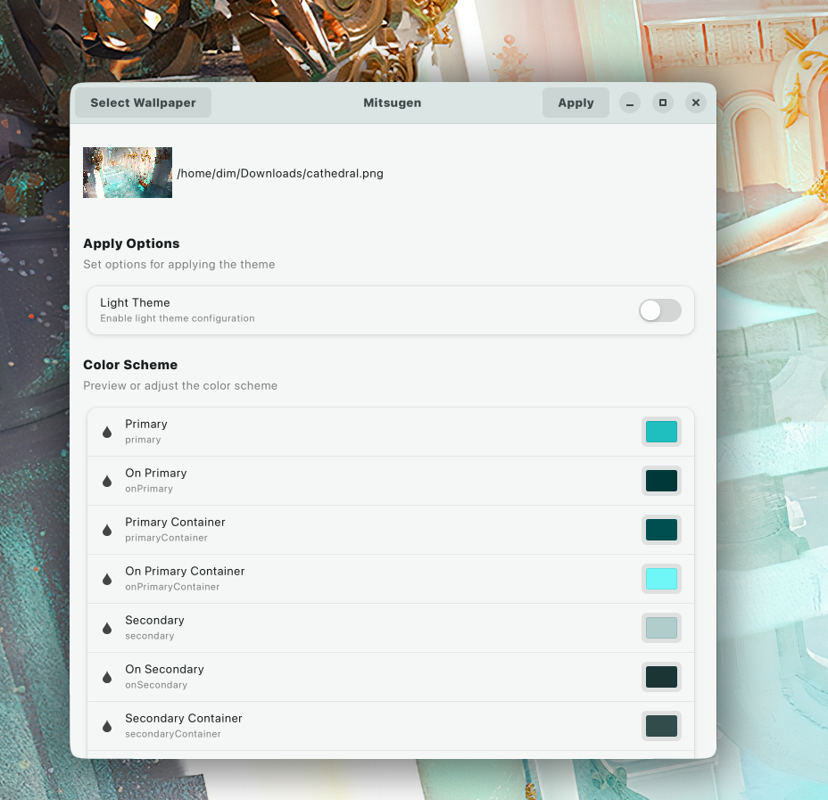

## Description

[Material Design 3](https://m3.material.io/) offers a new color system that allows for more flexible and dynamic use of color. The new system includes a wider range of colors, as well as a range of tints and shades that can be used to create subtle variations in color.

## Installation

1. Clone the repository:

```shell
git clone https://github.com/DimitrisMilonopoulos/mitsugen.git
```

2. Checkout to directory:

```shell
cd mitsugen
```

3. Install required assets for the project:

```shell
chmod +x install.sh
./install.sh
```

4. Assuming you already have [Poetry](https://python-poetry.org/) installed:

```shell
poetry install
```

# Templates included

- [x] Gnome shell
- [x] GTK4
- [x] GTK3
- [x] VSCODE custom CSS
- [x] Obisidian Adwaita theme (Requires `Adwaita` theme)
- [x] Vivaldi theme
- [x] BetterDiscord theme
- [ ] Spotify theme
- [ ] Any other theme you want me to add

# Usage

## Prerequisites

1. Put the assets in the `assets` folder in the `config.ini` specified dirs. (Will create an installation script in the foreseeable future)
2. Update the `example/templates/config.ini` with your paths

3. Execute the following command and enjoy your new theme :smile:
   UI option

```shell
poetry run python src/main.py --ui
```

For dark theme:

```shell
poetry run python src/main.py --wallpaper <wallpaper_path>
```

For light theme:

```shell
poetry run python src/main.py --wallpaper <wallpaper_path> -l
```

4. For adaptive folder icons make sure to install [Papirus Folders](https://github.com/PapirusDevelopmentTeam/papirus-folders) and have papirus on your `.local/share/icons` folder. Otherwise you will need admin permissions.


# Screenshots

## GTK4 WIP UI!



## Obisidian Dark


## Obsidian Light


## Gnome Theming Dark


## Gnome Theming Light


## VSCODE themes


### Note: need to set the color for the terminal background properly and patch vscode to apply css

```json
{
  "workbench.colorCustomizations": {
    "terminal.background": "#1f1f1f"
  }
}
```

## BetterDiscord

Install [Material Discord](https://github.com/JustAlittleWolf/Material-You-Discord-Theme) and apply the script then enable the material you theme from the better Discord theme settings

# Special Thanks

- [Matugen](https://github.com/InioX/matugen)
- [Obisidian Adwaita theme](https://github.com/birneee/obsidian-adwaita-theme)
- [Material Color Utilities Python](https://github.com/avanisubbiah/material-color-utilities-python)
- [FluentUI vscode](https://marketplace.visualstudio.com/items?itemName=leandro-rodrigues.fluent-ui-vscode)

# Common issues

User themes command error

Run this:

```shell
sudo cp $HOME/.local/share/gnome-shell/extensions/user-theme@gnome-shell-extensions.gcampax.github.com/schemas/org.gnome.shell.extensions.user-theme.gschema.xml /usr/share/glib-2.0/schemas && sudo glib-compile-schemas /usr/share/glib-2.0/schemas
```

more info [here](https://gist.github.com/atiensivu/fcc3183e9a6fd74ec1a283e3b9ad05f0)
