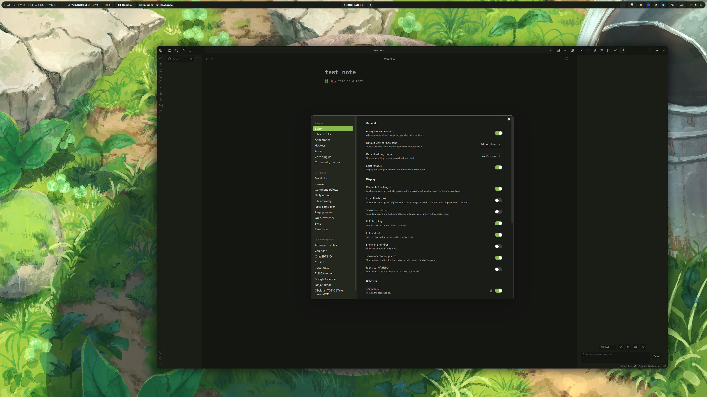
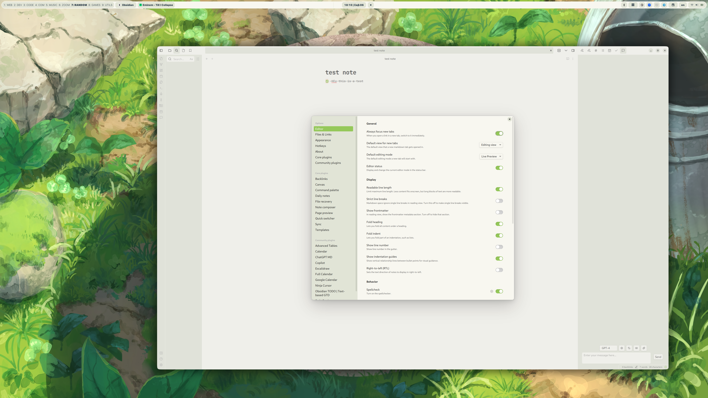

# Shameless fork of [matugen](https://github.com/InioX/matugen)
## Description
[Material Design 3](https://m3.material.io/) offers a new color system that allows for more flexible and dynamic use of color. The new system includes a wider range of colors, as well as a range of tints and shades that can be used to create subtle variations in color.

## Installation
Assuming you already have [Poetry](https://python-poetry.org/) installed:

```shell
git clone https://github.com/DimitrisMilonopoulos/mitsugen.git && cd mitsugen
poetry install
```

# Why did I fork this project

- Project Matugen is amazing, but it didn't work for my needs.
- I wanted to use gnome-shell theme
- I needed control over the generated colors 
- Ability to use different templates for dark and light theme instead of the same one

# Templates included 

- [x] Gnome shell
- [x] GTK4
- [x] GTK3
- [x] VSCODE custom CSS
- [x] Obisidian Adwaita theme
- [ ] Spotify theme
- [ ] Any other theme you want me to add

# Usage

## Prerequisites

1. Put the assets in the `assets` folder in the `config.ini` specified dirs. (Will create an installation script in the forceable future)
2. Update the `example/templates/config.ini` with your paths

3. Execute the following command and enjoy your new theme :smile:

For dark theme:

```shell
poetry run python src/main.py <wallpaper_path> 
```

For light theme:


```shell
poetry run python src/main.py <wallpaper_path> -l
```


# Screenshots

## Obisidian Dark


## Obsidian Light



## Gnome Theming Dark


## Gnome Theming Light


## VSCODE themes


### Note: need to set the color for the terminal background properly and patch vscode to apply css

```json
  {
  "workbench.colorCustomizations": {
    "terminal.background": "#1f1f1f",
  }}
```


# Special Thanks 
- [Obisidian Adwaita theme](https://github.com/birneee/obsidian-adwaita-theme)
- [Material Color Utilities Python](https://github.com/avanisubbiah/material-color-utilities-python)
- [Matugen](https://github.com/InioX/matugen)
- [FluentUI vscode](https://marketplace.visualstudio.com/items?itemName=leandro-rodrigues.fluent-ui-vscode)